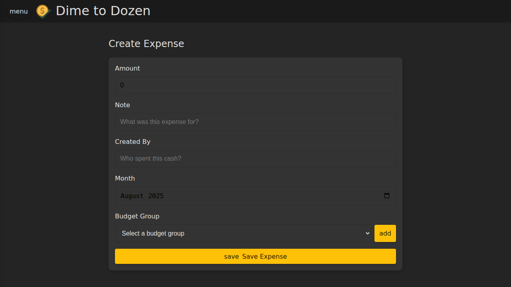
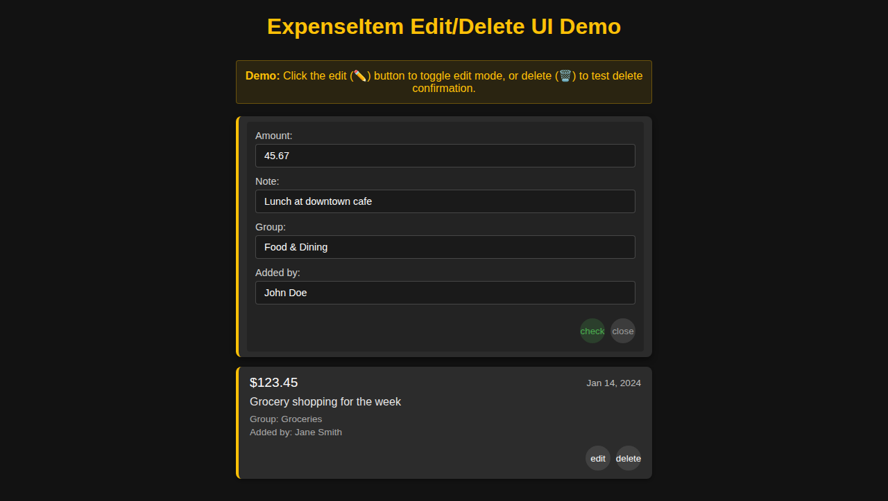
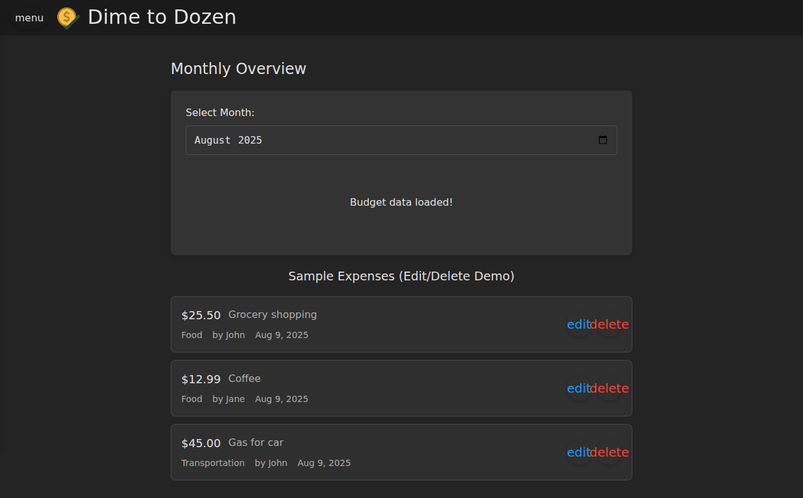

# Dime To Dozen

A full-stack budget tracking and expense management web application built with
modern technologies. The motivation for this project was to explore and
understand the limits of "vibe coding" while gaining hands-on experience with
Deno, Vue 3, Drizzle ORM, Neon Database, and Deno Deploy.

## Features

### 📊 Expense Tracking

- **Create Expenses**: Log expenses with customizable categories, amounts, and
  descriptions
- **View & Edit**: Review and modify expense items with an intuitive interface
- **Real-time Updates**: Changes are immediately reflected in your budget
  overview

 _Expense
tracking interface showing initial state_

 _Edit mode
with inline controls_

 _Saved expense
item_

### 📈 Monthly Overview

- **Budget Visualization**: See your spending patterns across different
  categories
- **Budget Meters**: Visual indicators showing spending vs. budget limits
- **Category Management**: Set and adjust budget limits for each expense
  category

### 🔄 Budget Groups

- **Copy Groups**: Duplicate budget configurations across different time periods
- **Quick Setup**: Reuse budget structures month-to-month

## Tech Stack

- **Frontend**: Vue 3, TypeScript, Vite
- **Backend**: Deno
- **Database**: PostgreSQL (Neon)
- **ORM**: Drizzle
- **Styling**: Material Design (dark theme, mobile-first)
- **Deployment**: Deno Deploy

## Getting Started

### Prerequisites

- Deno runtime
- PostgreSQL database (or Neon Database account)

### Installation

1. Install Deno:

```bash
curl -fsSL https://deno.land/install.sh | sh
```

2. Install dependencies:

```bash
deno install
```

_Note: AI agents may need to run `export DENO_TLS_CA_STORE=mozilla,system`
first_

3. Configure environment variables:

```bash
cp .env.example .env
# Edit .env with your database credentials and secrets
```

### Development

Start the development servers:

```bash
# Frontend dev server (Vite)
deno task dev
# Runs on http://localhost:5173/

# API server
deno task serve
# Runs on http://localhost:6960/
```

The Vite dev server is configured to listen on `0.0.0.0`, making it accessible
from external tools like Playwright MCP and other containerized services.

### Building

```bash
deno task build
```

Built files are output to the `dist/` directory and can be served statically.

### Database

Push schema changes:

```bash
deno task db:push
```

## Application Routes

- `/` - Create new expenses (home page)
- `/monthly-overview` - View budget overview and spending by category
- `/copy-groups` - Manage and duplicate budget groups

## Project Structure

```
├── src/                  # Vue frontend source
│   ├── components/      # Vue components
│   ├── App.vue         # Main app component
│   └── main.ts         # App entry point
├── server/              # Deno backend
│   ├── api/            # API endpoints
│   ├── db/             # Database schema & config
│   └── main.ts         # Server entry point
├── docs/               # Documentation & screenshots
└── public/             # Static assets
```

## Development Notes

- **Mobile-First Design**: The UI is optimized for mobile devices with a
  responsive layout
- **Dark Theme**: Consistent dark theme across all pages
- **Hot Reloading**: Both frontend and backend support watch mode for rapid
  development
- **Type Safety**: Full TypeScript coverage for both client and server code

## Code Quality

```bash
# Format code
deno fmt

# Check formatting
deno fmt --check

# Lint code
deno lint
```

## Deployment

The application is configured for automatic deployment to Deno Deploy via GitHub
Actions when changes are pushed to the master branch.
