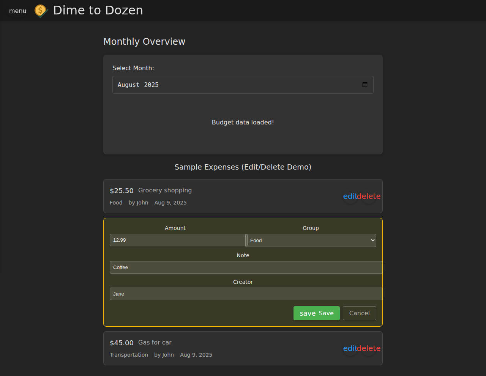

# Dime To Dozen

A full-stack budget tracking and expense management web application built with
modern technologies. The motivation for this project was to explore and
understand the limits of "vibe coding" while gaining hands-on experience with
Deno, Vue 3, Drizzle ORM, Neon Database, and Deno Deploy.

## Features

### 📊 Expense Tracking

- **Create Expenses**: Log expenses with customizable categories, amounts, and
  descriptions
- **View & Edit**: Review and modify expense items with an intuitive interface
- **Real-time Updates**: Changes are immediately reflected in your budget
  overview

 _Expense
tracking interface showing initial state_

 _Edit mode
with inline controls_

 _Saved expense
item_

### 📈 Monthly Overview

- **Budget Visualization**: See your spending patterns across different
  categories
- **Budget Meters**: Visual indicators showing spending vs. budget limits
- **Category Management**: Set and adjust budget limits for each expense
  category

### 🔄 Budget Groups

- **Copy Groups**: Duplicate budget configurations across different time periods
- **Quick Setup**: Reuse budget structures month-to-month

## Tech Stack

- **Frontend**: Vue 3, TypeScript, Vite
- **Backend**: Deno
- **Database**: PostgreSQL (Neon)
- **ORM**: Drizzle
- **Styling**: Material Design (dark theme, mobile-first)
- **Deployment**: Deno Deploy

---

To avoid duplicating documentation, more technical information about the project
can be found in
[`.github/copilot-instructions.md`](.github/copilot-instructions.md)
